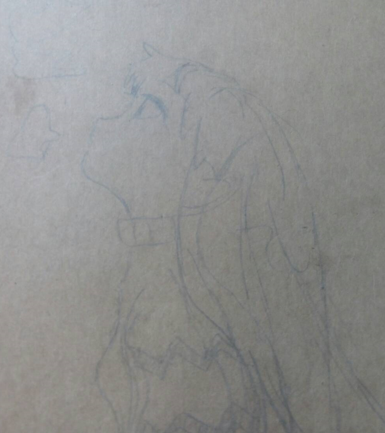
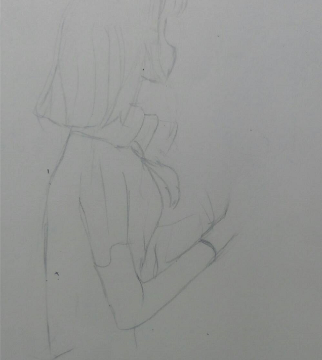

<html>
<head>
<meta name="EngJapKor" content="width=device-width, initial-scale=1">

</head>
<body>

  <a href="https://magijw.github.io/-English/" >English</a>
  <a href="https://magijw.github.io/-Japanese/">日本語</a>
  <a href="https://magijw.github.io/-Korean/" >한국어</a>

  
1 / 3

  

  
2 / 3

  

  
3 / 3

  

   
   
   

<button onclick="topFunction()" id="myBtn" title="Go to top">Top</button>

  

    

      
      

        <h2>楊靖緯</h2>
        
Sponsor & Developer

        
將文字連結文字，          讓生命感動生命

        
heyquerida@gmail.com

      

    

  

